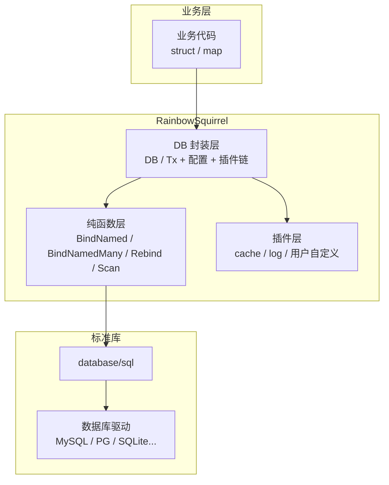
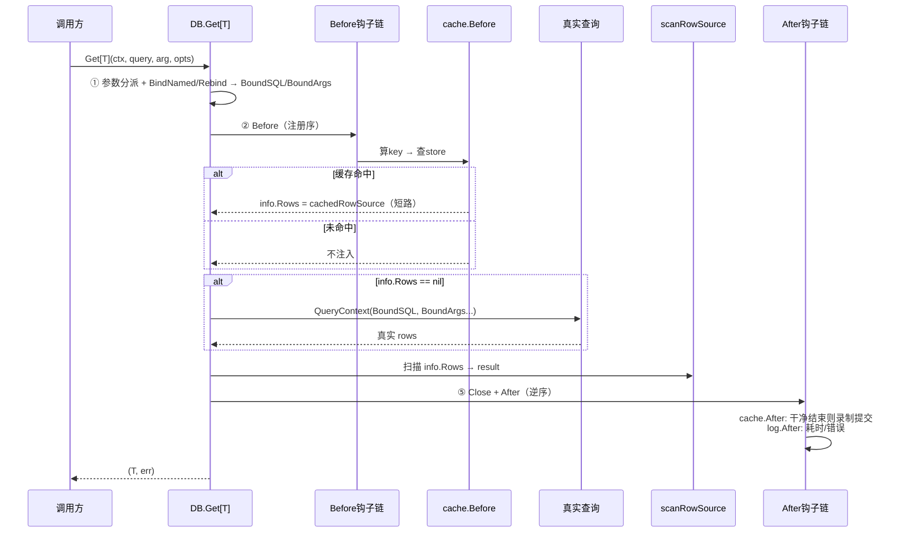

# RainbowSquirrel 设计文档

> 本文档为 RainbowSquirrel（`rainbowsquirrel`）轻量级 Go SQL 映射框架的定稿设计。所有决策经四轮讨论确认，决策记录见 §20。

---

## 1. 概述与定位

RainbowSquirrel 是一个轻量级 Go SQL 映射层，位于 `database/sql` 与业务代码之间，仅解决两类映射问题：

1. **参数绑定**：Go 值（struct / map / slice）→ SQL 参数
2. **结果映射**：SQL 查询结果 → Go 值（struct / map / 标量）

**框架不生成、不修改 SQL**，所有 SQL 由使用者输入。

| 属性 | 值 |
|---|---|
| 项目名 | RainbowSquirrel |
| 包名 | `rainbowsquirrel` |
| 模块路径 | `github.com/rambollwong/rainbowsquirrel` |
| 语言版本 | **Go 1.27+**（依赖方法泛型特性） |
| 运行时依赖 | **仅标准库**（`database/sql`、`reflect`、`sync`、`log/slog`），零第三方运行时依赖 |
| 协议 | MIT |

设计哲学：

- **轻量**：核心单包，无子包依赖；核心逻辑为无 DB 依赖的纯函数
- **边界明确**：不生成 SQL，不做 ORM 关联、迁移、连接管理
- **可扩展**：插件系统承载缓存、日志、指标等横切关注点
- **性能**：反射元数据缓存 + 类型匹配快路径

## 2. 边界与非目标

### 2.1 明确排除

| 排除项 | 说明 |
|---|---|
| SQL 生成/拼接 | 无 QueryBuilder、无链式 API、无 dialect 层 |
| 关联查询/预加载 | JOIN 由使用者编写 |
| 迁移/DDL | 不含 |
| 连接池 | 委托 `database/sql` |
| **Prepared statement 缓存** | 不在框架内管理 stmt；用户可经 `RawDB()`/`RawTx()` + 纯函数自行组合（ADR #43） |
| 查询缓存（核心内） | 缓存由插件提供，核心不含 |
| 跨库 SQL 差异 | 使用者保证 SQL 合法 |
| **表级智能失效** | 需要解析 SQL 提取表名，超出"不碰 SQL"边界，**本期明确排除** |

### 2.2 范围声明

以下操作属于**参数绑定**范畴，纳入框架：

- 命名占位符参数化（`:name` → 方言占位符 `?`/`$n`/`@n`）
- 批量命名绑定（`BindNamedMany`）
- `IN` 子句展开（显式开启，`WithSliceExpansion`）

其余任何改变 SQL 结构的操作均不纳入。

## 3. 架构总览

### 3.1 分层图



**核心原则**：绑定与扫描均为纯函数（无 DB 依赖、可独立测试）；`*DB`/`*Tx` 仅组合纯函数、配置与插件链。

### 3.2 读取管道时序（以 `Get` + 缓存插件为例）



## 4. 核心抽象

### 4.1 两条映射链路

| 链路 | 输入 | 输出 | 纯函数 |
|---|---|---|---|
| 绑定 Bind | SQL + Go 值 | 参数化 SQL + `[]any` | `BindNamed` / `BindNamedMany` / `Rebind` |
| 扫描 Scan | `RowSource` + `*dest` | 填充后的 dest | `Scan` |

### 4.2 RowSource（扫描层地基）

扫描逻辑只依赖 `RowSource` 接口而非 `*sql.Rows`，使缓存命中可"重放"：

```go
type RowSource interface {
    Columns() ([]string, error)
    Next() bool
    Scan(dest ...any) error
    Err() error
    Close() error
}
```

- `*sql.Rows` 原生满足该接口
- 缓存命中时由缓存插件构造 `cachedRowSource` 重放
- **扫描层不关心 rows 来源** → 缓存插件天然对 struct / map / 标量目标通用

## 5. 参数绑定

### 5.1 参数分派规则（`arg any`）

| 入参形态 | 路径 |
|---|---|
| 单个 struct / map | `BindNamed`（单对象命名绑定） |
| 单个 `[]struct` / `[]map` | `BindNamedMany`（批量命名绑定，语义见下） |
| `[]any` / 其他基础值 | 位置参数，`?` 原样透传 |

> **`BindNamedMany` 语义**：query 中须**恰好含一个连续命名占位符组**（典型 `VALUES (:a, :b)`），该组按 `args` 数量重复 N 组（`(?,?),(?,?)...`）；组外占位符单次绑定（从第一个对象取值）；多组或无组报错。**不支持**组内切片 IN 展开（与 `WithSliceExpansion` 不组合）。

> 使用者如需"位置传单个 map"，显式包一层 `[]any{map}` 即可。

### 5.2 占位符解析

- 语法：`:name`（sqlx 风格）；同时支持裸 `?` 位置参数透传
- 解析必须跳过：`::cast` 语法、单引号字符串字面量、`--` / `/* */` 注释（避免误伤 SQL 文本）
- 方言重绑定：`Rebind(query, style)` 将 `?` 转为 `$n`/`@n`（全局 `WithPlaceholder` 配置，默认 `?` 原样）；**复用同一占位符解析器**，仅替换真正占位符位置的 `?`，同样跳过 `::`、字符串字面量与注释
- 切片值 + `WithSliceExpansion(true)`：`:ids` 绑定 `[]int{1,2,3}` → `IN (?,?,?)` + `[1,2,3]`；**空切片报 `ErrSliceExpansion`**（`IN ()` 非法，交由使用者处理空场景）
- 缺失 key → `ErrPlaceholderNotFound`（无论 strict 与否，静默缺失不允许）

### 5.3 取值优先级（struct）

```
db tag 列名 → NameMapper(字段名) → 字段名精确匹配
```

内嵌（embedded）结构体字段递归展平后参与匹配；`time.Time`、`sql.Null*` 等特殊内嵌类型不展平，作为普通值处理。

### 5.4 绑定方向类型规则（Go → DB）

| 源类型 | 处理 |
|---|---|
| 实现 `driver.Valuer` | 交给驱动 |
| `time.Time` / `[]byte` / nil / 基础类型 | 原样传入 |
| 指针 | 解引用，nil → nil |
| struct/map/slice（非基础） | 有 `json` tag → JSON 序列化；否则 `ErrUnsupportedType` |
| 命名占位符缺失 | `ErrPlaceholderNotFound` |

## 6. 结果映射

### 6.1 目标分派

| dest 形态 | 行为 |
|---|---|
| `Get[T]`（T 为 struct/map/标量，可为指针类型） | 单行填充；无行返回零值 + `sql.ErrNoRows`；`Get[*T]` 无行返回 nil |
| `Select[T]`（T 为 struct/map/标量，可为指针类型） | 逐行填充为 `[]T`；无行返回空非 nil 切片；`Select[*T]` 每行 new 一个；标量限单列，多列报 `ErrUnsupportedType` |
| `Get[map[string]any]` | 单行 map，key 为驱动列名（可配 `WithMapKeyFunc`） |
| `Select[map[string]any]` | `[]map[string]any` |
| 标量 T | 单列直接转换（`COUNT(*)` → `int64` 等）；**不再单设 `Scalar[T]`** |

### 6.2 列 → 字段匹配算法（struct 目标）

1. `rows.Columns()` 获取列名，基于缓存的 typeInfo 构建列 → 字段索引
2. 逐列匹配，优先级：`db` tag → `NameMapper(字段名)` → 大小写不敏感精确匹配
3. 内嵌 struct 展平后的字段同规则参与
4. 命中 → 按目标类型转换；未命中 → strict 模式报 `ErrColumnNotFound`，否则跳过

### 6.3 NULL 语义

| 目标类型 | NULL 行为 |
|---|---|
| 指针字段 | nil |
| `sql.Null*` 等 Scanner | 交给 Scanner |
| 基础类型 | 零值（`WithNullToZeroValue(true)` 默认）或报错（可配） |

### 6.4 扫描方向类型规则（DB → Go）

| 驱动值 | 目标类型 | 处理 |
|---|---|---|
| 类型完全匹配 | 基础类型 | 快路径直接 `rows.Scan` |
| 任意 | 实现 `sql.Scanner` | 交给 Scanner（`sql.Null*` 等） |
| `[]byte` / `string` | string / time.Time | 直接转换 / 按 `WithTimeLayout` 解析 |
| `int64`/`float64` | 各类数字/布尔 | 安全转换，溢出报错 |
| nil | 基础类型 | 零值/报错（可配） |
| 任意值 + `json` tag | 任意类型 | `json.Unmarshal` |
| 不匹配 | — | `ErrUnsupportedType` |

时区：`WithTimeLocation` 双向生效——扫描方向 `[]byte`/`string` → `time.Time` 按该时区解析；绑定方向 JSON 序列化前递归将嵌套 `time.Time` 值转换到该时区（顶层 `time.Time` 字段仍按 §5.4 原样传入驱动）。

## 7. 类型转换与 RegisterConverter

### 7.1 优先级链

```
目标类型实现 sql.Scanner → 注册表命中 → 内置转换矩阵 → ErrUnsupportedType
```

### 7.2 注册表

```go
// DB→Go 方向，按目标类型注册
func RegisterConverter[T any](fn func(driverVal any) (T, error))
```

- 内部实现：`sync.RWMutex` 保护的 `map[reflect.Type]ConverterFunc`
- 注册需在首次执行前完成；运行期注册在锁保护下安全但应避免（数据竞争语义明确）
- 绑定方向（Go→DB）不设注册表，走 `driver.Valuer` + 内置规则

## 8. Tag 规范

```go
type User struct {
    ID        int64     `db:"id"`
    Name      string    `db:"name"`
    Email     string    `db:"email,omitempty"` // 绑定时空值跳过（仅命名绑定有效）
    Profile   Profile   `db:"profile,json"`    // JSON 序列化/反序列化
    CreatedAt time.Time `db:"created_at"`
    Internal  string    `db:"-"`               // 忽略
    Base                // 内嵌结构体：字段自动展平
}
```

| 规则 | 说明 |
|---|---|
| tag 名 | 默认 `db`，可 `WithTagName` 修改（避免与 `encoding/json` 冲突） |
| 格式 | `db:"column,option1,option2"`，列名必填 |
| `-` | 忽略该字段 |
| `omitempty` | 仅影响绑定（空值绑定为 NULL），只对命名绑定有意义 |
| `json` | 该列按 JSON 编解码 |
| 内嵌展平 | 递归展平；`time.Time`、`sql.Null*` 不展平按值处理 |
| 非法 tag | `ErrTagInvalid` |

## 9. 元数据缓存与性能

- **typeInfo**：字段索引、tag 选项、是否内嵌、类型、列→字段映射索引；以 `reflect.Type` 为 key 存入 `sync.Map`，构建后不可变，并发安全
- **快路径**：列类型与字段类型完全一致 → 直接 `rows.Scan`，绕开中间转换
- **慢路径**：不一致时先 `Scan` 进 `*any` 再按规则转换
- **缓冲复用**：`sync.Pool` 复用转换临时缓冲区（实现期评估）

## 10. 插件系统

### 10.1 接口

```go
type Plugin interface {
    Name() string
    Before(ctx context.Context, info *ExecInfo) (context.Context, error)
    After(ctx context.Context, info *ExecInfo) error
}
```

### 10.2 ExecInfo

```go
type ExecInfo struct {
    Op        Op            // OpExec / OpQuery / OpGet / OpSelect
    Query     string        // 原始 SQL
    Arg       any           // 原始绑定对象
    BoundSQL  string        // BindNamed/Rebind 之后
    BindSQL   string        // BindNamed 输出（Rebind 前，CacheKey 口径）
    BindArgs  []any         // BindNamed 输出参数（slice 展开前，CacheKey 口径）
    BoundArgs []any         // 最终参数
    Options   []CallOption  // 本次调用选项，插件 type-switch 自取
    InTx      bool          // 是否事务内
    Start     time.Time
    Duration  time.Duration // After 时已填充（Query 统计到 Close）
    Rows      RowSource     // Before 可注入（短路）
    Result    sql.Result    // 仅 OpExec
    Err       error         // After 时已填充
}
```

### 10.3 钩子语义（门/旁路）

| 阶段 | 语义 |
|---|---|
| `Before` | **门**：返回 err → 中止本次操作，返回包装错误（`%w`）；**After 仍触发**（`info.Err` 为该错误，日志/指标可见） |
| `After` | **旁路**：扫描/执行已完成，返回 err 或 panic **不影响主结果**；错误/panic 经 `WithPluginErrorHandler(func(plugin string, err error))` 上报，不阻断后续插件 |
| 多插件 | Before 按注册序、After 逆序（栈语义）；单个 After 错误不阻断后续插件 |

### 10.4 时序

- Bind 出错同样进入 After（`info.Err` 已填），日志插件可见
- `Query` 返回实时 rows：Before 照常；返回包装类型 `*rainbowsquirrel.Rows`（内嵌 `*sql.Rows`，`Next`/`Scan`/`Close` 等方法自动提升），**After 延迟到用户 `Close()` 时触发**（Duration 统计到 Close）
- 缓存协作接口（核心导出，供 cache 插件使用）：`RowWrapper`/`WithRowWrapper(ctx, w)` 让插件在 Before 注入 rows 包装器（真实 rows 在 Before 之后才存在，核心查询后调用包装）；`RowRecorder`（`RecordRow(values []any)`）由核心扫描层检测——RowSource 实现该接口时每行先取驱动原始值并回调，再转换写回 dest；`ValueRowSource`（`RowValues()`）由命中重放的 RowSource 实现，核心包装为内部重放源并用 DB 级配置转换。`RowWrapper` 仅在 Get/Select 路径生效，Query 不支持

### 10.5 生命周期

- 注册：`WithPlugin(p ...Plugin)` 于 `New` 时，或 `d.Use(p...)`
- **首次执行后注册 → `ErrPluginRegisteredTooLate`**
- 内部 `sync.RWMutex` 保护

## 11. 缓存插件（`rainbowsquirrel/cache`）

### 11.1 生效范围与启用

- **仅服务 `Get`/`Select`**（完全消费型读）；`Query` 返回实时 rows，不缓存
- **默认关闭**，显式 `WithTTL` 启用
- 事务内**自动跳过**（不命中、不写入）——事务读须反映未提交写入，缓存会破坏隔离性

### 11.2 命中/未命中流程

- **命中**：`Before` 注入 `cachedRowSource` → 核心正常扫描 → 零真实查询
- **未命中**：核心执行真实查询 → 扫描过程中 `recordingRowSource` 透明录制（包装真实 rows，`Scan` 先取临时 `[]any` 原始单元格值录制，再经核心导出函数 `ConvertAssign` 写回 dest）→ 扫描**干净结束**（无 scan err、`rows.Err()==nil`、strict 模式未报错）后于 `Close()` 提交 `store.Set`；中途出错丢弃
- 录制的是**原始单元格值**而非扫描结果 → 缓存与目标类型解耦；为此核心导出 `ConvertAssign(dest any, driverVal any) error` 供录制路径复用
- **命中重放**：`cachedRowSource` 实现核心导出的 `ValueRowSource`（暴露原始缓存值）；核心扫描前将其包装为内部重放源，转换使用 **DB 级配置**（WithTimeLayout/WithTimeLocation/WithNullToZeroValue 均生效，ADR #38）

### 11.3 Store 接口（可插拔 backend）

```go
type Store interface {
    Get(ctx context.Context, key string) ([]byte, bool, error)
    Set(ctx context.Context, key string, value []byte, ttl time.Duration) error
    Delete(ctx context.Context, key string) error
    DeletePrefix(ctx context.Context, prefix string) error // 域删除：删除所有 prefix 开头的 key
    Flush(ctx context.Context) error
}
```

内置 `NewMemoryStore(capacity int, defaultTTL time.Duration)`：

- 读取时惰性过期
- 容量超限按 **LRU** 淘汰（`container/list` + map）
- 不做主动后台清理（轻量优先）

未来可接其他后端，仅需实现 Store 接口。已提供 `rainbowsquirrel/cache/redis` 可选包（基于 `go-redis/v9`，`WithKeyPrefix` 支持安全 Flush，DeletePrefix 用 SCAN+DEL）：

```go
// rainbowsquirrel/cache/redis（可选包，实现 cache.Store）
func NewStore(client *redis.Client, opts ...Option) *Store
func WithKeyPrefix(prefix string) Option // 建议配置：Flush 只删该前缀；否则 FLUSHDB
```

### 11.4 序列化 codec

驱动标准返回类型有限：`nil / int64 / float64 / bool / string / []byte / time.Time`。内置自定义二进制 codec（快、保留类型、确定性），支持 `WithCodec` 替换。

```
magic(2B) + version(1B) + 列数(varint) + 列名表 + 行数(varint) + 单元格流
单元格 = 类型标签(1B) + payload

0x00 NULL           -
0x01 int64          varint
0x02 float64        8B LE
0x03 bool           1B
0x04 string         varint len + utf8
0x05 []byte         varint len + raw
0x06 time.Time      unixnano(varint) + 时区偏移分钟(varint)
```

实现值：`magic = 0x52 0x53`（'R''S'），`version = 1`；varint 使用 `encoding/binary` 无符号/补码 varint。

**time.Time 编码约定**：UnixNano + 时区偏移分钟，重放 `time.Unix(0, nano).In(fixedZone)`。代价为丢失单调钟与 DST 历史——约定"**结果等价而非逐位等价**"。

### 11.5 Cache Key

```
逻辑 key = namespace + "\x00" + hex(sha256(namespace + "\x00" + boundSQL + "\x00" + encode(BoundArgs)))
store key = keyPrefix + 逻辑 key
```

> `boundSQL` 为 **BindNamed 输出**（Rebind 前、`?` 形式），**方言无关**——`Rebind` 不改变 key，`CacheKey`/`InvalidateQuery` 可为纯函数。

- 基于 **BindNamed 输出** SQL 与参数（确定性、无歧义）
- namespace 在 store key 中**明文前缀**存在，使 `InvalidateNamespace`（`DeletePrefix`）可行
- `CacheKey` 返回**逻辑 key**（不含 keyPrefix）；`Invalidate`/`InvalidateQuery` 内部自动补 keyPrefix
- namespace 来自 `WithNamespace`，支持业务域隔离与批量失效
- 可选 `WithKeyPrefix` 全局前缀

### 11.6 失效策略

| 方式 | API | 说明 |
|---|---|---|
| 精确删除（推荐） | `InvalidateQuery(ctx, namespace, query, arg)` | 内部 BindNamed + 算 key 后删单条 |
| 精确删除（底层） | `Invalidate(ctx, key)` | 删单条（key 为内部 sha256） |
| 域删除 | `InvalidateNamespace(ctx, ns)` | 删该 namespace 全部 |
| 全量 | `Flush(ctx)` | 清空 |
| 写后全量 | `WithInvalidateOnWrite()`（插件配置） | 任何 Exec 成功后 Flush（兜底，安全保守） |
| 写后按域 | Exec 带 `WithInvalidateNamespace(ns)` | 写后仅失效该 namespace |
| ~~表级智能~~ | — | **排除**（需解析 SQL，违背边界） |

### 11.7 防击穿

内置 singleflight（`cache/flight.go` 自实现，零依赖）：相同 key 的并发查询只执行一次（leader 放行查询、follower 等待后重读缓存），默认开启（`WithSingleflight(false)` 可关）。

### 11.8 公开 API

```go
func New(store Store, opts ...Option) *Cache      // 实现 rainbowsquirrel.Plugin
func WithDefaultTTL(d time.Duration) Option
func WithInvalidateOnWrite() Option
func WithSingleflight(enabled bool) Option        // 默认 true
func WithKeyPrefix(prefix string) Option
func WithCodec(c Codec) Option

func (c *Cache) InvalidateQuery(ctx context.Context, namespace, query string, arg any) error // 推荐：内部 BindNamed + 算 key
func (c *Cache) Invalidate(ctx context.Context, key string) error                           // 底层：删单条（key 为内部 sha256）
func (c *Cache) InvalidateNamespace(ctx context.Context, ns string) error
func (c *Cache) Flush(ctx context.Context) error

// 辅助函数（纯函数，调试/高级用）
func CacheKey(namespace, query string, arg any) (string, error)

// CallOption（rainbowsquirrel.CallOption）
func WithTTL(d time.Duration) rainbowsquirrel.CallOption
func WithNamespace(ns string) rainbowsquirrel.CallOption
func WithNoCache() rainbowsquirrel.CallOption
func WithInvalidateNamespace(ns string) rainbowsquirrel.CallOption

type Codec interface {
    Encode(*RowData) ([]byte, error)
    Decode([]byte) (*RowData, error)
}
type RowData struct { Columns []string; Rows [][]any }
```

## 12. 日志插件（`rainbowsquirrel/log`）

作为插件系统的**第二个参考实现**（验证钩子时序与错误语义）。

```go
func New(logger *slog.Logger, opts ...Option) *Log
func WithLevel(l slog.Level) Option                 // 记录阈值，默认 Info
func WithSlowQueryThreshold(d time.Duration) Option // 超时单独 Warn
func WithQuery(enabled bool) Option                 // 输出 SQL，默认 true
func WithArgs(enabled bool) Option                  // 输出参数，默认 false（防泄漏）
```

行为：Before 记录开始；After 记录耗时、`info.Err`（含 Bind 失败、无行、Before 中止等全部错误路径）；Query 于 Close 时输出。

另提供 `rainbowsquirrel/log/rainbowlog` 可选子包：基于 `github.com/rambollwong/rainbowlog` 结构化日志库的同语义插件（`New(logger *rlog.Logger, opts ...Option)`，Option 与 slog 版一致）。

## 13. 事务

```go
func (d *DB) BeginTx(ctx context.Context, opts *sql.TxOptions) (*Tx, error)
func (tx *Tx) Begin(ctx context.Context) (*Tx, error) // 嵌套事务（SAVEPOINT）
func (tx *Tx) Commit() error
func (tx *Tx) Rollback() error
func (tx *Tx) RawTx() *sql.Tx
// Exec / Query / Get[T] / Select[T]：与 DB 同签名
```

- `Tx` 与 `DB` **共享**同一套 config 与插件链（插件实例无需感知 Tx 差异）
- **缓存插件事务内自动跳过**（见 §11.1）
- 其余插件（日志、指标）在 Tx 下行为与 DB 下完全一致
- **嵌套事务（`Tx.Begin`）**：基于 `SAVEPOINT` 实现，子 Tx 共享同一底层 `*sql.Tx`——子 `Rollback` 仅回滚到保存点并释放，子 `Commit` 仅释放保存点，均不影响外层事务；子 Tx 结束后复用返回 `sql.ErrTxDone`
- `RawTx()` 为逃生舱

## 14. 配置项总表

### 14.1 全局配置（`Option`）

| Option | 默认 | 说明 |
|---|---|---|
| `WithTagName("db")` | `db` | tag 名 |
| `WithNameMapper(snakeCase)` | snake_case | 字段名→列名 |
| `WithPlaceholder(Question)` | Question | 占位符方言 |
| `WithStrictMode(false)` | false | 未知列/缺失字段报错 |
| `WithSliceExpansion(false)` | false | IN 展开 |
| `WithNullToZeroValue(true)` | true | NULL → 零值 |
| `WithTimeLocation(loc)` | 驱动默认 | 时区基准 |
| `WithTimeLayout(RFC3339Nano)` | RFC3339Nano | 时间解析/格式化 |
| `WithMapKeyFunc(identity)` | identity | map 结果 key 处理 |
| `WithPlugin(...)` / `Use(...)` | 无 | 插件注册 |
| `WithPluginErrorHandler(nil)` | nil | After 错误上报回调 |

### 14.2 调用级（`CallOption`）

| CallOption | 归属 | 说明 |
|---|---|---|
| `WithStrictModeCall(bool)` | 核心 | 本次覆盖全局 strict |
| `cache.WithTTL(d)` | cache | 本次 TTL |
| `cache.WithNamespace(ns)` | cache | 缓存域 |
| `cache.WithNoCache()` | cache | 本次跳过缓存 |
| `cache.WithInvalidateNamespace(ns)` | cache | Exec 后仅失效该域 |
| `log.WithLevel(l)` | log | 本次日志级别（可选实现） |

`CallOption` 为密封接口（`callOption()` 私有方法），核心收集进 `ExecInfo.Options`。子包（cache/log）无法实现含未导出方法的接口，故核心暴露构造器 `NewCallOption(key, value any) CallOption`（配合未导出 key 类型）与取回函数 `CallOptionKeyValue(o) (key, value any)`：子包通过构造器创建强类型选项，在钩子中遍历 `info.Options` 经 `CallOptionKeyValue` 取回后按 key type-switch。

## 15. API 全量签名

```go
package rainbowsquirrel

// ===== 入口 =====
func New(db *sql.DB, opts ...Option) *DB

// ===== DB =====
type DB struct{}
func (d *DB) Exec(ctx context.Context, query string, arg any, opts ...CallOption) (sql.Result, error)
func (d *DB) Query(ctx context.Context, query string, arg any, opts ...CallOption) (*Rows, error)
func (d *DB) Get[T any](ctx context.Context, query string, arg any, opts ...CallOption) (T, error)
func (d *DB) Select[T any](ctx context.Context, query string, arg any, opts ...CallOption) ([]T, error)
func (d *DB) BeginTx(ctx context.Context, opts *sql.TxOptions) (*Tx, error)
func (d *DB) RawDB() *sql.DB

// ===== Tx =====
type Tx struct{}
func (tx *Tx) Begin(ctx context.Context) (*Tx, error) // 嵌套事务（SAVEPOINT，§13）
func (tx *Tx) Commit() error
func (tx *Tx) Rollback() error
func (tx *Tx) Exec(ctx context.Context, query string, arg any, opts ...CallOption) (sql.Result, error)
func (tx *Tx) Query(ctx context.Context, query string, arg any, opts ...CallOption) (*Rows, error)
func (tx *Tx) Get[T any](ctx context.Context, query string, arg any, opts ...CallOption) (T, error)
func (tx *Tx) Select[T any](ctx context.Context, query string, arg any, opts ...CallOption) ([]T, error)
func (tx *Tx) RawTx() *sql.Tx

// ===== Rows 包装 =====
type Rows struct{ *sql.Rows } // Close() 触发 After，Duration 统计到 Close（§10.4）

// ===== 纯函数 =====
func BindNamed(query string, arg any) (string, []any, error)
func BindNamedMany(query string, args []any) (string, []any, error) // 单组 VALUES 重复语义（§5.1）
func Rebind(query string, style PlaceholderStyle) string            // 复用解析器，跳过字面量/注释/::（§5.2）
func Scan(rs RowSource, dest any) error                             // 消费整个 RowSource；dest 为 *T（单行）/ *[]T（多行）
func ConvertAssign(dest any, driverVal any) error                   // 原始单元格值 → dest，cache 录制路径复用（§11.2）

// ===== 插件系统 =====
type Plugin interface{ Name() string; Before(context.Context, *ExecInfo) (context.Context, error); After(context.Context, *ExecInfo) error }
type ExecInfo struct{ /* 见 §10.2 */ }
type RowSource interface{ Columns() ([]string, error); Next() bool; Scan(...any) error; Err() error; Close() error }
type RowRecorder interface{ RecordRow(values []any) }   // cache 录制协作（§10.4）
type RowWrapper func(rs RowSource) RowSource             // cache rows 包装协作（§10.4）
type ValueRowSource interface{ RowValues() ([]string, [][]any) } // cache 命中重放协作（§10.4）
func WithRowWrapper(ctx context.Context, w RowWrapper) context.Context
type Op int
const (OpExec Op = iota; OpQuery; OpGet; OpSelect)

// ===== 转换器 =====
func RegisterConverter[T any](fn func(driverVal any) (T, error))

// ===== 配置 =====
type Option func(*config)
type CallOption interface{ callOption() }
func NewCallOption(key, value any) CallOption            // 密封扩展构造器，供子包 cache/log 创建调用级选项（§14.2）
func CallOptionKeyValue(o CallOption) (key, value any)   // 子包取回自建调用级选项（§14.2）
type NameMapper func(string) string
type PlaceholderStyle int
const (PlaceholderQuestion PlaceholderStyle = iota; PlaceholderDollar; PlaceholderAt)
// Option 与 CallOption 清单见 §14
```

使用示例：

```go
db := rainbowsquirrel.New(rawDB,
    rainbowsquirrel.WithStrictMode(true),
    rainbowsquirrel.WithPlugin(cachePlugin, logPlugin),
)

u, err := db.Get[User](ctx,
    `SELECT * FROM users WHERE id = :id`,
    map[string]any{"id": 1},
    cache.WithTTL(30*time.Second), cache.WithNamespace("users"))

res, err := db.Exec(ctx,
    `INSERT INTO users (name, age) VALUES (:name, :age)`, user)
cachePlugin.InvalidateNamespace(ctx, "users")

tx, _ := db.BeginTx(ctx, nil)
u2, _ := tx.Get[User](ctx, `SELECT * FROM users WHERE id = :id`, map[string]any{"id": 2}) // 事务内自动跳过缓存
tx.Commit()
```

## 16. 错误码表

| 错误 | 场景 |
|---|---|
| `sql.ErrNoRows`（透传） | `Get` 无行 |
| `ErrUnsupportedType` | 不支持的绑定/扫描目标类型 |
| `ErrPlaceholderNotFound` | 命名占位符在参数中缺失 |
| `ErrColumnNotFound` | strict 模式下列无对应字段 |
| `ErrTagInvalid` | tag 格式非法 |
| `ErrSliceExpansion` | 空切片无法展开 IN |
| `ErrNullNotAllowed` | `WithNullToZeroValue(false)` 时 NULL 写入基础类型字段 |
| `ErrPluginRegisteredTooLate` | 首次执行后注册插件 |

约定：

- 所有错误统一 `fmt.Errorf("...: %w", err)` 包装，保证 `errors.Is` 可用
- 错误文案带 SQL 全文与参数类型摘要（不输出参数值），便于排查且不泄漏数据
- 插件 Before 错误包装为 `"%s: plugin %s: %w"`

## 17. 测试策略

| 层级 | 手段 | 覆盖 |
|---|---|---|
| 纯函数单测 | `github.com/DATA-DOG/go-sqlmock` 伪造 rows | BindNamed/BindNamedMany/Rebind/Scan 全路径 |
| 表驱动 | 无 DB | 类型转换矩阵（NULL、[]byte、time、时区、JSON、溢出） |
| 插件单测 | sqlmock + 假插件 | 钩子时序、短路、错误语义、Query Close 时机 |
| 缓存单测 | 内存 Store | 命中/未命中/录制提交/失效/singleflight/事务跳过 |
| 集成测试 | `modernc.org/sqlite` 内存库 + PostgreSQL 16（Docker，`TEST_PG_DSN` 环境变量，未设置则 skip） | 真实 SQL 端到端、方言兼容 |
| 基准测试 | `testing.B` | 缓存命中/未命中、快/慢路径扫描吞吐 |

## 18. 性能目标

- 元数据缓存命中后，单行扫描开销 ≤ 手写 `rows.Scan` 的 **1.5x**
- 快路径（类型一致）不引入额外分配
- `sync.Map` 查询热路径无锁竞争（读多写少）
- 缓存命中路径（Get/Select）零 DB 调用

## 19. 版本规划

### v1.0.0（本期）

- 核心绑定/扫描、方法泛型 API、事务、插件系统、缓存插件、日志插件、RegisterConverter
- Go 1.27+，零第三方运行时依赖

### 未来候选（不承诺）

- 表级失效启发式插件（独立 opt-in，解析简单 `INSERT/UPDATE/DELETE` 表名，不保证正确）
- 更多内置插件：metrics（OpenTelemetry）、重试、审计
- 自定义占位符语法扩展

## 20. 决策记录（ADR 摘要）

| # | 决策点 | 结论 | 理由 |
|---|---|---|---|
| 1 | 项目/包名 | RainbowSquirrel / `rainbowsquirrel` | 与 Masterminds/squirrel 区分，包名统一避免混淆 |
| 2 | 定位 | 薄映射层，不生成/修改 SQL | 价值聚焦绑定与映射，边界清晰 |
| 3 | 占位符 | `:name` + `?` 透传 | sqlx 生态惯例；参数化属绑定范畴 |
| 4 | 参数分派 | `arg any` 单一对象 | 与绑定语义吻合；配合 CallOption 无变参冲突 |
| 5 | 方言重绑定 | `Rebind` + `WithPlaceholder` | 参数化而非 SQL 生成 |
| 6 | IN 展开 | 显式开启，空切片报错 | 改变占位符数，默认保守 |
| 7 | 批量绑定 | `BindNamedMany` | 批量写入刚需，SQL 仍由用户写 |
| 8 | 扫描目标 | `Get[T]`/`Select[T]`/map/标量，删 Scalar | 方法泛型覆盖，减少 API 面 |
| 9 | 未知列 | 默认跳过，strict 报错 | 兼容演进；strict 防静默丢列 |
| 10 | 列匹配 | tag → NameMapper → 大小写不敏感 | 三级回退，兼顾显式与便利 |
| 11 | JSON | 显式 `json` tag | 避免隐性序列化歧义 |
| 12 | NULL | 指针→nil、Scanner、基础→零值 | 与 gorm 惯例一致，可配 |
| 13 | 无行语义 | Get→`sql.ErrNoRows`；Select→空切片 | 标准生态惯例 |
| 14 | API 形态 | Go 1.27 方法泛型 + 密封 CallOption | 类型安全、显式 |
| 15 | 事务 | Tx 共享插件链；事务内缓存跳过 | 缓存破坏事务隔离性 |
| 16 | 插件机制 | 两阶段钩子；Before=门、After=旁路 | 门/旁路语义简单清晰 |
| 17 | 缓存 | 默认关、显式开；二进制 codec；手动+写后失效 | 安全优先、性能与可控性兼顾；表级失效越界排除 |
| 18 | 日志插件 | slog 对接，作第二参考实现 | 验证插件机制通用性 |
| 19 | 转换器 | 按目标类型注册 | DB→Go 以目标为准 |
| 20 | 配置 | 全局 Option + 调用级强类型 CallOption | 层次清晰、可发现 |
| 21 | CallOption 密封扩展 | 核心暴露 `NewCallOption(key, value)` + 未导出 key 类型，子包经构造器创建强类型选项 | 子包无法实现私有方法接口，兼顾密封与可扩展 |
| 22 | Query 返回类型 | 返回包装类型 `*rainbowsquirrel.Rows`（内嵌 `*sql.Rows`），Close 时触发 After | 兑现 §10.4 延迟统计，调用方方法自动提升 |
| 23 | 缓存录制实现 | `recordingRowSource` 先 Scan 进临时 `[]any` 录制原始值，再经核心导出 `ConvertAssign` 写回 dest | 保证录制原始单元格值，缓存与目标类型解耦 |
| 24 | 精确失效 API | 保留底层 `Invalidate(ctx, key)`，新增 `InvalidateQuery`（推荐）与 `CacheKey` 纯函数 | 用户无法手算内部 sha256 key |
| 25 | BindNamedMany 语义 | 单组 VALUES 重复：恰好一个连续占位符组按 args 数量重复，组外单次绑定，多组/无组报错 | 批量写入刚需，语义边界明确 |
| 26 | Scan 消费语义 | Scan 消费整个 RowSource；dest 为 `*T`（单行，无行 `sql.ErrNoRows`）或 `*[]T`（多行，空切片）；Get/Select 共用 | 统一分派，避免重复循环逻辑 |
| 27 | 泛型指针参数 | T 允许为指针：`Get[*T]` 无行返回 nil，`Select[*T]` 每行 new | 与 sqlx/gorm 惯例一致 |
| 28 | Rebind 解析规则 | 复用占位符解析器，仅替换真占位符 `?`，跳过字符串/注释/`::` | 与 §5.2 一致，避免误伤 SQL 文本 |
| 29 | Select 标量 | 支持 `Select[标量]`（单列），多列报 `ErrUnsupportedType` | 与 Scan 的 `*[]T` 分派天然对齐 |
| 30 | CacheKey 口径 | key 基于 BindNamed 输出（Rebind 前 `?` 形式），方言无关 | CacheKey/InvalidateQuery 可为纯函数，失效不依赖方言配置 |
| 31 | ExecInfo 扩展 | 新增 `BindSQL`/`BindArgs`（BindNamed 输出、展开前），作为 CacheKey 口径 | 区分 Rebind 前/后与展开前/后，保证 key 与 `CacheKey` 纯函数一致 |
| 32 | 缓存协作接口 | 核心导出 `RowWrapper`/`WithRowWrapper` 与 `RowRecorder`，新增 `CallOptionKeyValue` | recording 需在真实查询后包装；子包无法断言未导出 callOption 类型 |
| 33 | Store 接口扩展 | 新增 `DeletePrefix`；store key = keyPrefix + namespace + `"\x00"` + sha256 | 域删除需要明文 namespace 前缀，否则无法按域失效 |
| 34 | 实现期默认决策 | `ErrNullNotAllowed`；`string`→`time.Time` 同 `[]byte`；`BindNamedMany` 空 args 报错；codec magic=`0x52 0x53`/version=1 | 关闭实现期待定项 |
| 35 | 缓存命中重放限制 | `cachedRowSource` 经 `ConvertAssign` 包级默认规则写回 dest | DB 级 time/layout/nullToZero 配置在命中路径不生效（v1 已知限制） |
| 36 | omitempty 语义 | 空值绑定为 NULL（占位符保留、参数传 nil） | 不改变 SQL 结构，语义清晰 |
| 37 | 错误脱敏 | 错误包装带 SQL 全文 + 参数类型摘要（不输出参数值） | 便于排查且不泄漏数据 |
| 38 | 命中重放接管 | `cachedRowSource` 实现 `ValueRowSource`，核心包装为内部重放源并用 DB 级配置转换 | 解除 ADR #35 限制，命中路径与真实路径规则一致 |
| 39 | After panic | After panic 经 recover 上报，不传播、不阻断后续插件 | 与旁路语义一致 |
| 40 | 时区绑定方向 | `WithTimeLocation` 双向生效：JSON 序列化前递归转换嵌套 `time.Time` | 与 §6.4"解析/格式化基准"一致 |
| 41 | Query 与 RowWrapper | `RowWrapper` 仅在 Get/Select 生效，Query 不支持（文档注明） | 返回 Rows 包装 *sql.Rows，无法容纳任意 RowSource |
| 42 | 批量绑定边界 | 组外占位符从第一个对象取值；批量不支持切片 IN 展开 | 明确隐含决策 |
| 43 | Prepared statement | v1 不做框架级 stmt 缓存；用户经 `RawDB()`/`RawTx()` + 纯函数自行组合 | 薄映射层定位；database/sql 与驱动已处理直通路径；收益被框架开销稀释 |
| 44 | 嵌套事务 | `Tx.Begin` 用 `SAVEPOINT` 实现；子 Rollback 回滚到保存点、子 Commit 释放保存点，均不影响外层；结束后复用返回 `sql.ErrTxDone` | 兑现 §19 未来候选，SAVEPOINT 为 SQL 标准 |

### 实现期待定项

（无——先前待定项已在 ADR #36–#40 中敲定。）

---

**定稿确认**：以上为 RainbowSquirrel 最终设计文档（对应仓库 `doc/design.md`）。实现阶段如有偏离本文档的调整，应回到 §20 追加 ADR 记录。